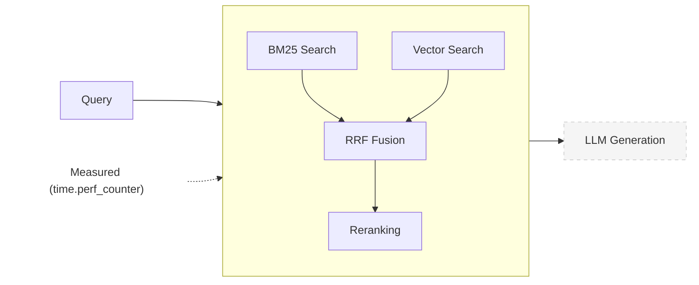

# Measurement Methodology

## Abstract

We measured reranking overhead in a production RAG system across 4 LLM families and 2 providers. Mean overhead: 27.2ms (+/-4.6ms), representing 0.3% of total query time. No statistically significant difference across models (ANOVA p=0.34).

## Methods

### Measurement Scope

We measured **retrieval latency only** - query submission to ranked document retrieval, excluding LLM generation.



| Component | Included | Typical Time |
|-----------|----------|--------------|
| BM25 search | Yes | ~15ms |
| Vector search | Yes | ~25ms |
| RRF fusion | Yes | ~2ms |
| Reranking | Yes (when enabled) | ~31ms |
| LLM generation | No | ~4,000ms |

Excluding LLM generation isolates the true cost of reranking, which would otherwise be masked by 4-second response times.

### Corpus

- 7,432 pages, 20,679 chunks
- Legacy enterprise software documentation (PDFs)
- 1,000-token chunks with 200-token overlap

### Retrieval Pipeline

```
Query -> BM25 (top 16) + Vector (top 16) -> RRF Fusion -> Rerank (top 8) -> LLM
```

- Hybrid retrieval: BM25 (lexical) + dense vectors (semantic)
- Fusion: Reciprocal Rank Fusion (RRF) with k=60
- Reranking: FlashRank cross-encoder, 16 candidates to 8 results

### Software Versions

| Component | Version | Notes |
|-----------|---------|-------|
| Python | 3.11+ | Required |
| flashrank | 0.2.10 | Reranking inference |
| langchain | 1.2.3 | Orchestration |
| langchain-aws | 1.2.1 | Amazon Bedrock integration |
| langchain-chroma | 1.1.0 | Vector store |
| langchain-huggingface | 1.2.0 | Embeddings |
| chromadb | 1.4.0 | Vector database |
| sentence-transformers | 5.2.0 | Embedding models |
| rank-bm25 | 0.2.2 | Lexical search |

### Models

| Component | Model | Size |
|-----------|-------|------|
| Embeddings | sentence-transformers/all-MiniLM-L6-v2 | 22M params |
| Reranking | ms-marco-MiniLM-L-12-v2 | ~4MB |

CPU-only inference via FlashRank (Python).

### Hardware

- MacBook Pro M-series, 16GB RAM
- CPU-only (no GPU acceleration)

### Experimental Design

| Parameter | Value |
|-----------|-------|
| Queries | 20 domain-specific (configuration, troubleshooting, architecture) |
| Runs per query | 3 iterations (reduces OS scheduling noise while keeping total runtime practical) |
| Conditions | With reranking vs. without reranking |
| Warm-up | Embeddings, vector store, BM25 index pre-loaded |
| Timing | `time.perf_counter()` around retrieval call |

### Models Tested

| Model | Family | Size | Provider |
|-------|--------|------|----------|
| Claude Haiku 4.5 | Anthropic | - | Amazon Bedrock |
| Mistral Devstral-2512 | Mistral | 22B | OpenRouter |
| Llama 3.3 70B Instruct | Meta | 70B | OpenRouter |
| Qwen 2.5 Coder 32B | Alibaba | 32B | OpenRouter |

**Total measurements:** 480 (120 Bedrock + 360 OpenRouter)

---

## Results

### Single-Model (Amazon Bedrock)

| Condition | Mean | Median | Min | Max |
|-----------|------|--------|-----|-----|
| With reranking | 79.1ms | 82.1ms | 50.3ms | 124.6ms |
| Without reranking | 47.8ms | 49.9ms | 32.5ms | 80.6ms |
| **Overhead** | **31.3ms** | 32.2ms | 17.8ms | 44.0ms |

### Multi-Model (OpenRouter)

| Model | Overhead |
|-------|----------|
| Mistral Devstral-2512 | 32.5ms |
| Llama 3.3 70B Instruct | 24.1ms |
| Qwen 2.5 Coder 32B | 25.1ms |
| **Mean** | **27.2ms +/-4.6ms** |

### Cross-Provider Comparison

| Provider | Mean Overhead |
|----------|---------------|
| Amazon Bedrock | 31.3ms |
| OpenRouter | 27.2ms |
| **Difference** | **4.1ms** |

### Statistical Analysis

**One-way ANOVA (cross-model variance, OpenRouter models only):**

| Metric | Value |
|--------|-------|
| Between-group variance | 423.7 ms^2 |
| Within-group variance | 385.8 ms^2 |
| F(2,57) | 1.10 |
| p-value | 0.34 |
| Eta-squared | 0.037 (3.7% of variance explained by model choice) |

Shapiro-Wilk tests indicate non-normal distributions in 2 of 3 groups (right-skewed latency data). Levene's test confirms equal variances (p=0.058). Because ANOVA is violated on normality, we confirm with a non-parametric test:

**Kruskal-Wallis (non-parametric confirmation):** H=0.48, p=0.78.

Both tests agree: model choice does not significantly affect reranking overhead.

> [!NOTE]
> ANOVA p=0.34, Kruskal-Wallis p=0.78, eta-squared=0.037. Model choice explains 3.7% of overhead variance. The result is robust to the normality violation.

**95% Confidence Intervals:**

| Model | Overhead | 95% CI |
|-------|----------|--------|
| Mistral Devstral-2512 | 32.5ms | [17.5, 47.5] |
| Llama 3.3 70B Instruct | 24.1ms | [20.5, 27.7] |
| Qwen 2.5 Coder 32B | 25.1ms | [21.0, 29.2] |

```text
Reranking Overhead: 95% Confidence Intervals

Mistral Devstral  |         [-------|---------------]
Llama 3.3 70B     |              [--|--]
Qwen 2.5 Coder    |              [----|]
                  |----|----|----|----|----|----|----| 
                  15   20   25   30   35   40   45  50
                              Overhead (ms)
```

---

## Discussion

### Comparison to Prior Work

| Source | Reported Overhead | Our Result |
|--------|-------------------|------------|
| [FlashRank paper](https://github.com/PrithivirajDamodaran/FlashRank) | 50-100ms | 31ms |
| [CustomGPT (2025)](https://customgpt.ai/what-is-a-reranker/) | 50-150ms | 31ms |
| [LangChain docs](https://python.langchain.com/docs/concepts/retrievers/) | "negligible for <1000 candidates" | 31ms for 16 |

Lower overhead likely due to: small candidate set (16 vs 50-100), CPU-optimized model, efficient hybrid retrieval.

### Design Rationale

- **Warm cache:** Production systems operate with warm caches; cold start (2.2s) is one-time.
- **Multiple runs:** 3 iterations reduce OS scheduling noise, background processes, memory allocation variance.
- **Retrieval isolation:** Enables accurate overhead calculation and fair cross-provider comparison.

### Limitations

- **Domain specificity:** Enterprise software documentation only. Results may vary for conversational queries, multi-hop reasoning, or non-technical domains.
- **Hardware:** CPU-only. GPU would reduce overhead further.
- **Provider variability:** OpenRouter free tier may introduce rate limiting. Mitigated by averaging.

---

## Accuracy Evaluation

### Scoring Methodology

We evaluated RAG system accuracy across 32 scored queries (Phase 2 + Phase 4) using a three-tier scoring system:

- **pass**: Complete, accurate answer directly supported by retrieved context
- **partial**: Useful information but incomplete, with caveats, or requiring external knowledge
- **fail**: Unable to answer, incorrect information, or corpus gap

### Phase Progression Rationale

1. **Phase 1 (8 queries, unscored)**: Exploration to identify failure modes and retrieval patterns
2. **Phase 2 (12 queries, scored)**: Systematic evaluation with manual scoring and failure mode classification
3. **Phase 3 (4 validations)**: Ground truth validation of high-confidence Phase 1-2 passes to check for false positives
4. **Phase 4 (20 queries, scored)**: Expanded evaluation for publication confidence
5. **Phase 4 validation (4 validations)**: Additional ground truth validation of Phase 4 passes

This progression allows early detection of systematic issues (Phase 1), establishes baseline metrics (Phase 2), validates confidence in those metrics (Phase 3), and expands the sample for publication (Phase 4) with additional validation (Phase 4 validation).

### Ground Truth Validation Method

Manual corpus search using `rg` (ripgrep) against Oracle Essbase 11.1.x documentation. For each validated query:

1. Extract key claims from the RAG system's answer
2. Search the source corpus for supporting documentation
3. Verify each claim against source sections
4. Assess accuracy percentage (100% = all claims verified, 95% = minor discrepancies, etc.)
5. Check for false positives (claims not in corpus but presented as fact)

Results: 8 validations across Phase 3-4, 98.1% average accuracy, 0% false positive rate.

### Sample Size Justification

- **Phase 2 (12 queries)**: 3 per category provides initial confidence
- **Phase 3 validation (4 queries)**: Validates high-confidence passes; 0% false positive rate on 4 validations supports confidence in Phase 2 metrics
- **Phase 4 (20 queries)**: Expands to 5 per category for publication-grade confidence
- **Phase 4 validation (4 queries)**: Additional validation confirms Phase 4 quality

Combined 32 scored queries with 8 ground truth validations (25% validation rate) provides adequate confidence for published pass rates.

---

## Reproducibility

### Data Files

| File | Description |
|------|-------------|
| `data/raw_timings.csv` | Anonymized raw timing data (480 measurements) |
| `scripts/stats_analysis.py` | Statistical analysis script (ANOVA, 95% CI) |
| `benchmark_retrieval.py` | Benchmark runner implementation |

### Reproducing the Analysis

```bash
# Install dependencies with uv
uv run --with scipy python scripts/stats_analysis.py
```

See [uv](https://docs.astral.sh/uv/) for package manager documentation.

### Data Format

`raw_timings.csv` columns:
- `query_id`: Anonymized query identifier (Q1-Q20)
- `model`: LLM model name
- `provider`: bedrock or openrouter
- `condition`: with_rerank or without_rerank
- `run`: Run number (1-3)
- `latency_ms`: Retrieval latency in milliseconds

Sample data (first 3 rows):

```csv
query_id,model,provider,condition,run,latency_ms
Q1,claude-haiku-4.5,bedrock,with_rerank,1,62.9
Q1,claude-haiku-4.5,bedrock,with_rerank,2,124.6
Q1,claude-haiku-4.5,bedrock,with_rerank,3,65.7
```

### Methodology

1. Set up hybrid RAG (BM25 + vector + reranking)
2. Define 20 domain-specific queries
3. Run each query 3x with/without reranking
4. Measure retrieval time only (exclude LLM generation)
5. Calculate mean, median, min, max per condition

---

See [README.md](README.md) for results summary and project overview.
