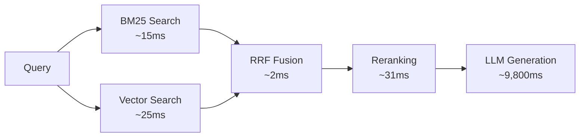

<div align="center">

# RAG Reranking Benchmarks

[](LICENSE)
[](https://github.com/clouatre-labs/rag-reranking-benchmarks)
[](https://python.org)
[](data/raw_timings.csv)

Does reranking actually slow down RAG queries? We measured it. 480 timing measurements across 4 model families and 2 providers say: **no, +31ms is noise in a multi-second pipeline.**

Supplementary materials for [Making Legacy Knowledge Searchable with RAG](https://clouatre.ca/posts/rag-legacy-systems/).

</div>

## The Question

Reranking improves retrieval quality by reordering candidate chunks before they reach the LLM. But it adds a neural inference step. In a production RAG pipeline serving legacy enterprise documentation, is the latency cost worth it?

```text
Total query time (typical):  ~10,000ms
├── LLM generation:           ~9,800ms  (98%)
├── Vector + BM25 retrieval:     ~120ms  (1.2%)
├── Reranking (FlashRank):        ~31ms  (0.3%)  <-- this is what we measured
└── Other (embedding, RRF):       ~49ms  (0.5%)
```

---

## Results

See [METHODOLOGY.md](METHODOLOGY.md) for measurement approach and statistical methods.

### Reranking Latency (Single-Model, Production)

| Metric | With Reranking | Without Reranking | Delta |
|--------|----------------|-------------------|-------|
| Mean | 79.1ms | 47.8ms | **+31.3ms** |
| Median | 82.1ms | 49.9ms | +32.2ms |
| Min | 50.3ms | 32.5ms | +17.8ms |
| Max | 124.6ms | 80.6ms | +44.0ms |

### Cross-Model Validation

| Model | Size | Provider | Reranking Overhead |
|-------|------|----------|-------------------|
| Claude Haiku 4.5 | - | Amazon Bedrock | baseline |
| Mistral Devstral | 22B | OpenRouter | +32.5ms |
| Llama 3.3 | 70B | OpenRouter | +24.1ms |
| Qwen 2.5 Coder | 32B | OpenRouter | +25.1ms |

ANOVA p=0.34, eta-squared=0.037: model choice explains 3.7% of overhead variance. Kruskal-Wallis confirms (p=0.78). Cross-provider delta (Bedrock vs OpenRouter): 4.1ms. See [METHODOLOGY.md](METHODOLOGY.md#statistical-analysis) for assumption checks.

### Query Category Accuracy

Evaluation across 32 scored queries (Phase 2 + Phase 4) with ground truth validation:

| Category | Queries | Pass | Partial | Fail | Pass Rate |
|----------|---------|------|---------|------|-----------|
| error_lookup | 8 | 4 | 1 | 3 | 50% |
| conceptual | 8 | 7 | 1 | 0 | 88% |
| procedural | 8 | 8 | 0 | 0 | 100% |
| multi_hop | 8 | 5 | 2 | 1 | 62% |
| **Total** | **32** | **24** | **4** | **4** | **75%** |

0% false positive rate. 98.1% average accuracy on ground truth validation (8 validations across Phase 3-4). See [`query-category-eval/`](query-category-eval/) for phase-by-phase results.

---

## System Under Test



```text
Corpus:      7,432 pages / 20,679 chunks (Oracle Essbase 11.1.x documentation)
Retrieval:   Hybrid (BM25 + vector search, RRF fusion)
Reranker:    FlashRank ms-marco-MiniLM-L-12-v2 (~4MB, CPU-only)
Pipeline:    16 candidates retrieved, reranked to top 8
Hardware:    MacBook Pro M-series (CPU only, no GPU)
Measurements: 480 total (120 single-model + 360 multi-model)
```

---

## How It Works

### Hybrid Retriever

```python
class HybridRetriever:
    """Combines BM25 keyword search with vector similarity search and FlashRank reranking."""

    def __init__(self, chunks: list[Document], vector_store: Chroma,
                 k: int = 8, use_rerank: bool = True):
        self.chunks = chunks
        self.vector_store = vector_store
        self.k = k
        self.use_rerank = use_rerank
        self.bm25 = BM25Okapi([doc.page_content.lower().split() for doc in chunks])  # simplified; production uses custom tokenizer
        self._ranker: Ranker | None = None  # lazy-loaded

    @property
    def ranker(self) -> Ranker:
        if self._ranker is None:
            self._ranker = Ranker()  # FlashRank, ~4MB, CPU-only
        return self._ranker
```

### Reranking Step

The `_rerank` method is the +31ms we measured. FlashRank scores each chunk against the query using a cross-encoder, then returns the top candidates by relevance:

```python
    def _rerank(self, query: str, docs: list[Document]) -> list[Document]:
        """Rerank documents using FlashRank cross-encoder. Adds ~31ms."""
        passages = [
            {"id": i, "text": doc.page_content, "meta": doc.metadata}
            for i, doc in enumerate(docs)
        ]
        results = self.ranker.rerank(RerankRequest(query=query, passages=passages))
        return [docs[result["id"]] for result in results[:RERANK_TOP_N]]
```

### Reciprocal Rank Fusion

BM25 and vector search each return 16 candidates. RRF combines the two ranked lists into a single score, so documents found by both methods float to the top:

```python
    def invoke(self, query: str) -> list[Document]:
        bm25_scores = self.bm25.get_scores(query.lower().split())  # simplified; production uses custom tokenizer
        bm25_top = sorted(range(len(bm25_scores)),
                          key=lambda i: bm25_scores[i], reverse=True)[:16]
        vector_results = self.vector_store.similarity_search_with_score(query, k=16)

        # Reciprocal rank fusion (k=60)
        doc_scores: dict[str, tuple[Document, float]] = {}
        for rank, idx in enumerate(bm25_top):
            doc_id = self.chunks[idx].metadata.get("source", "") + str(hash(self.chunks[idx].page_content[:100]))
            doc_scores[doc_id] = (self.chunks[idx],
                                  doc_scores.get(doc_id, (None, 0))[1] + 1 / (rank + 60))
        for rank, (doc, _) in enumerate(vector_results):
            doc_id = doc.metadata.get("source", "") + str(hash(doc.page_content[:100]))
            doc_scores[doc_id] = (doc,
                                  doc_scores.get(doc_id, (None, 0))[1] + 1 / (rank + 60))

        sorted_docs = sorted(doc_scores.values(), key=lambda x: x[1], reverse=True)
        candidates = [doc for doc, _ in sorted_docs[:16]]

        return self._rerank(query, candidates) if self.use_rerank else candidates[:self.k]
```

### Cross-Model Validation

The statistical analysis validates that reranking overhead is model-agnostic across all 4 LLM families:

```python
def calculate_overhead_per_query(data: list[dict]) -> dict[tuple[str, str], float]:
    """Overhead = mean(with_rerank) - mean(without_rerank) per query per model."""
    grouped: dict[tuple[str, str, str], list[float]] = defaultdict(list)
    for row in data:
        grouped[(row["model"], row["query_id"], row["condition"])].append(row["latency_ms"])

    overheads = {}
    for model, query_id in {(r["model"], r["query_id"]) for r in data}:
        with_rr = grouped.get((model, query_id, "with_rerank"), [])
        without_rr = grouped.get((model, query_id, "without_rerank"), [])
        if with_rr and without_rr:
            overheads[(model, query_id)] = mean(with_rr) - mean(without_rr)
    return overheads

# One-way ANOVA: p=0.34, no significant difference across models
per_model = defaultdict(list)
for (model, _), overhead in overheads.items():
    per_model[model].append(overhead)
f_stat, p_value = f_oneway(*per_model.values())
```

---

## Project Structure

```text
rag-reranking-benchmarks/
├── README.md                          # This file
├── METHODOLOGY.md                     # Measurement approach and statistical methods
├── LICENSE                            # Apache-2.0
├── benchmark_retrieval.py             # Reproducible benchmark template
├── results_summary.json               # Aggregate timing data
├── data/
│   └── raw_timings.csv                # 480 anonymized measurements
├── scripts/
│   └── stats_analysis.py              # ANOVA, 95% CI, cross-model comparison
└── query-category-eval/
    ├── README.md                      # Evaluation methodology
    ├── query_classification.json      # 20 queries across 4 categories
    ├── phase1_results.json            # Raw RAG responses
    ├── phase2_results.json            # Manual ground truth labels
    ├── phase3_validation.json         # Automated accuracy scoring
    ├── phase4_results.json            # Final analysis and failure modes
    └── phase4_validation.json         # Validation results
```

---

## Reproducing

```bash
git clone https://github.com/clouatre-labs/rag-reranking-benchmarks
cd rag-reranking-benchmarks

# Run statistical analysis on existing data
python scripts/stats_analysis.py

# Adapt the benchmark template for your own RAG system
# (see inline comments in benchmark_retrieval.py)
```

See [METHODOLOGY.md](METHODOLOGY.md) for the full measurement approach.

---

## Adapting for Your System

The benchmark script is a template. To benchmark your own RAG pipeline, customize these 4 key points in `benchmark_retrieval.py`:

1. **`setup_rag_components()`** - Initialize your vector store, BM25 index, and embeddings model
2. **`create_retriever()`** - Build your retriever with your reranking model and fusion strategy
3. **`TEST_QUERIES`** - Define domain-specific test queries (aim for 20+ covering different categories)
4. **`retrieve()`** - Implement the actual retrieval call with your pipeline

The statistical analysis script works on any CSV with the same column schema as `data/raw_timings.csv`.

---

## Citation

```bibtex
@misc{clouatre2026ragreranking,
  author = {Clouatre, Hugues},
  title  = {RAG Reranking Benchmarks},
  year   = {2026},
  note   = {Supplementary materials for "Making Legacy Knowledge Searchable with RAG"},
  url    = {https://clouatre.ca/posts/rag-legacy-systems/}
}
```

---

## License

[Apache-2.0](LICENSE)
